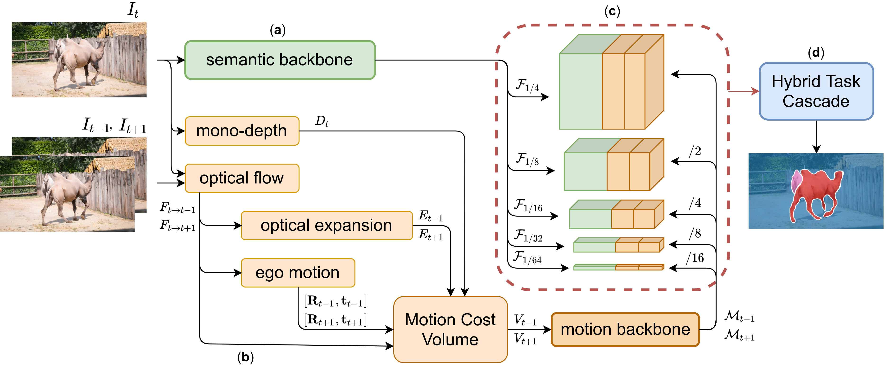

# Raptor - Monocular Arbitrary Moving Object Discovery and Segmentation

### Changelog
* [June 2022] Added Singularity container DEMO ([information in Container section](./README.md#Container)) 

Official repository with implementation of the paper: <br>
Neoral, M.; Šochman, J. & Matas, J.: "**Monocular Arbitrary Moving Object Discovery and Segmentation**", BMVC 2021<br>

[:page_facing_up:PAPER-PDF](https://www.bmvc2021-virtualconference.com/assets/papers/1500.pdf) |
[:movie_camera:POSTER-VIDEO](https://www.bmvc2021-virtualconference.com/conference/papers/paper_1500.html) |
[:film_strip:POSTER-SLIDES](https://docs.google.com/presentation/d/18L7vNkBCsQ2mmfzCSwgnJuR0L3R8ffZ0KzzaonRFCuc/edit?usp=sharing)



### Authors:
* Michal Neoral (neoramic@fel.cvut.cz)
* Jan Šochman (jan.sochman@fel.cvut.cz)
* Jiří Matas (matas@fel.cvut.cz, matas@cmp.felk.cvut.cz)

If you use this work please cite:
<pre>
@InProceedings{
    Neoral2021,
    author    = {Neoral, Michal and {\v{S}}ochman, Jan and Matas, Ji{\v{r}}{\'i}},
    title     = {Monocular Arbitrary Moving Object Discovery and Segmentation},
    booktitle = {The 32nd British Machine Vision Conference -- BMVC 2021},
    year      = {2021},
    }
</pre>

## Abstract
We propose a method for discovery and segmentation of objects that are, or their parts are,
independently moving in the scene. Given three monocular video frames, 
the method outputs semantically meaningful regions, i.e. regions corresponding to the whole object, 
even when only a part of it moves. <br>
The architecture of the CNN-based end-to-end method, called Raptor, 
combines semantic and motion backbones, which pass their outputs to a final region segmentation network. 
The semantic backbone is trained in a class-agnostic manner in order to generalise 
to object classes beyond the training data. The core of the motion branch is a geometrical cost volume
computed from optical flow, optical expansion, mono-depth and the estimated camera motion. <br>
Evaluation of the proposed architecture on the instance motion segmentation and binary moving-static
segmentation problems on KITTI, DAVIS-Moving and YTVOS-Moving datasets shows that the proposed method 
achieves state-of-the-art results on all the datasets and is able to generalise well to various 
environments. For the KITTI dataset, we provide an upgraded instance motion segmentation 
annotation which covers all moving objects. Dataset, code and models are available 
on the github project page [github.com/michalneoral/Raptor](github.com/michalneoral/Raptor).

## License
Copyright (c) 2021 Toyota Motor Europe<br>
Patent Pending. All rights reserved.

Author: Michal Neoral, CMP FEE CTU Prague
Contact: neoramic@fel.cvut.cz

This work is licensed under a <a rel="license" href="http://creativecommons.org/licenses/by-nc-sa/4.0/">Creative Commons Attribution-NonCommercial-ShareAlike 4.0 International License</a>

## About Repository / TODO

There may be changes in the future version of the code. The repository contains a partial release for evaluation and inference. 

- [x] Dataset(s)
- [x] Demo/Inference code
- [x] Evaluation/Test code
- [x] Trained model - final
- [ ] Trained models - for individual parts
- [ ] Documentation
- [ ] Training code
- [ ] MMFLOW-RAFT instead of RAFT


## Installation

#### Works with the following versions of libraries:
- Python 3.8
- CUDA 11.1.
- PyTorch 1.9.0
- Torchvision 0.10.0

#### MMCV, MMDET, MMFLOW
Recommendation: install following repos directly from the source, follow instruction from github:
 - [MMCV](https://github.com/open-mmlab/mmcv)
 - [MMDET](https://github.com/open-mmlab/mmdetection)

#### Raptor - this repo
```shell
git clone https://github.com/michalneoral/Raptor
cd Raptor
pip install -v -e .
```

#### RAFT - modified version
```shell
git clone git@github.com:michalneoral/raft_fork.git
cd raft_fork
pip install -v -e .
```


## Dataset
Information about using and downloading training and evaluation dataset may be found in the [Datasets README](raptor/datasets/README.md).

## Model download
```
cd raptor/weights
bash download_weights.sh
```


## Demo
1. Run Help for inference demo to see possible args:
    ```shell
    python demo/inference_demo_raptor_sequence.py
    --help
    ```

2. Running Raptor BMVC configuration for single directory:
    ```shell
    python demo/inference_demo_raptor_sequence.py
    --gpuid #YOUR_GPU_NUMBER
    --config_file configs/moseg/raptor.py
    --checkpoint_file weights/raptor_bmvc_2021.pth
    --save_custom_outputs
    --save_outputs
    --input_dict #PATH_TO_INPUT_SEQUENCE_OF_IMAGES_DIRECTORY
    --output_dict #PATH_TO_OUTPUT_DIRECTORY
    ```

3. Running Raptor BMVC configuration for multiple directories (i.e. DAVIS):
    ```shell
    python demo/inference_demo_raptor_sequence.py
    --gpuid #YOUR_GPU_NUMBER
    --config_file configs/moseg/raptor.py
    --checkpoint_file weights/raptor_bmvc_2021.pth
    --save_custom_outputs
    --save_outputs
    --search_subdirs
    --input_dict #PATH_TO_INPUT_DIRECTORY_WITH_SEQUENCE_OF_IMAGES_DIRECTORIES
    --output_dict #PATH_TO_OUTPUT_DIRECTORY
    ```
   
4. Note: There are several other options
    
    ```shell
    --confidence_threshold #OPTION_FOR_IMAGE_GENERATION - it will draw only segments above set threshold (0.0-1.0)
    
    --baseline  #Original camera baseline  - default=1
    --focal     #Camera calib focal lenght - default according to image dimmensions 
    --camera_dx #Camera calib mid-point dx - default according to image dimmensions
    --camera_dy #Camera calib mid-point dy - default according to image dimmensions
    
    --specific_subdir # use if the image sequence dir is contained in some specific subdir i.e. {input_dict}/sequence/{specific_subdir}/*.jpg|png
    ```

## Testing / evaluation
Before the evaluation: You have to [download datasets](raptor/datasets/README.md) and change paths to the data in the following files:
```shell
raptor/configs/_base_/datasets/*.py
```


1. Run Help for test to see possible args
    ```shell
    python tools/test_with_wandb.py
    --help
    ```
   
2. Test
    ```shell
    python tools/test_with_wandb.py
    --config_file configs/moseg/raptor.py
    --checkpoint_file weights/raptor_bmvc_2021.pth
    --eval bbox segm
    ```


## Training
will be added

## Notes
Raptor was evaluated with using of [ngransac](https://github.com/vislearn/ngransac) for BMVC'21 paper results.
The opencv-ransac is used for simplification of installation.
Install NGRANSAC and change configuration file if you want to achieve the same results.
```python
# raptor/configs/raptor/raptor_raft_bwfw_detrs_r18_siamese_sem_detrs_htc_r50_1x_ft3d_od_pretrained.py
motion_cost_volume=dict(
            type='RAFTplus',
            # ...
            use_opencv=True, # True: opencv - False: ngransac - for E,R,t estimation
            # ...
            )
```

## Container
    
For the Raptor demo, the [Singularity container (version 3.7)](https://sylabs.io/guides/3.7/user-guide/) was created.

#### Getting raptor_demo container
You can download Raptor demo Singularity container from the [gdrive](https://drive.google.com/file/d/1QHFZXoDMQ4nJAAVbyPwJjFU54vfT7_kc/view?usp=sharing) or using gdown:
```bash
gdown https://drive.google.com/uc?id=1QHFZXoDMQ4nJAAVbyPwJjFU54vfT7_kc -O raptor_demo.sif
```
or you can build it from the [recipe file](https://github.com/michalneoral/Raptor/blob/main/raptor_demo.def).

The MMCV inside the container was compiled with NVidia Compute Compatibility **6.1** (NVidia GTX 10XX(Ti), QUADRO P, TESLA P and newer).
If you need to compile the demo for an older graphic card, set your Compute Compatibility on line 107 in the [recipe file](https://github.com/michalneoral/Raptor/blob/main/raptor_demo.def).
Then build the container from scratch:
```bash
sudo singularity build raptor_demo.sif /path/to/raptor/git/Raptor/raptor_demo.def
```

#### Running raptor_demo container
First, you have to specify your torch cache directory. It has to be outside the container with writing access - some weights are downloaded during the first container run.

```bash
SINGULARITYENV_CACHE_TORCH='/mnt/path/to/your/dir/.cache'
```

If there are some troubles during downloading files from torch hub, you can download them from [gdrive](https://drive.google.com/file/d/1ldBp03F2sCRG4SaDs-KLaCDApEOjHAuh/view?usp=sharing).
In case you have gdown installed:
```bash
gdown https://drive.google.com/uc?id=1ldBp03F2sCRG4SaDs-KLaCDApEOjHAuh -O Raptor_cache.zip
```

RUN example for KITTI dataset:
```bash
SINGULARITYENV_CACHE_TORCH='/mnt/path/to/your/dir/.cache' singularity run --nv raptor_demo.sif \
--gpuid 1                            # specify GPU number \
--input_dict /mnt/your/path/to/kitti/KITTI/multiview/training/image_2 # specify dict with your images \
--output_dict /mnt/your/save/path/   # you have to have writing access \
--extension png                      # pick only png images from the dir \
--save_custom_outputs --save_outputs # have to be set to produce output images \
--file_prefix 000049_                # produce output only for particular subset of images
```

Basically, **the switches are the same as defined above for the demo**, except you do not have to specify config_file and checkpoint_file.

## Acknowledgement

The research was supported by CTU student grant SGS20/171/OHK3/3T/13 and by Toyota
Motor Europe.

#### Please consider seeing the following work:
- [Learning to Segment Rigid Motions from Two Frames](https://github.com/gengshan-y/rigidmask)
    <pre>
    @inproceedings{yang2021rigidmask,
    title={Learning to Segment Rigid Motions from Two Frames},
    author={Yang, Gengshan and Ramanan, Deva},
    booktitle={CVPR},
    year={2021}
    }
    </pre>